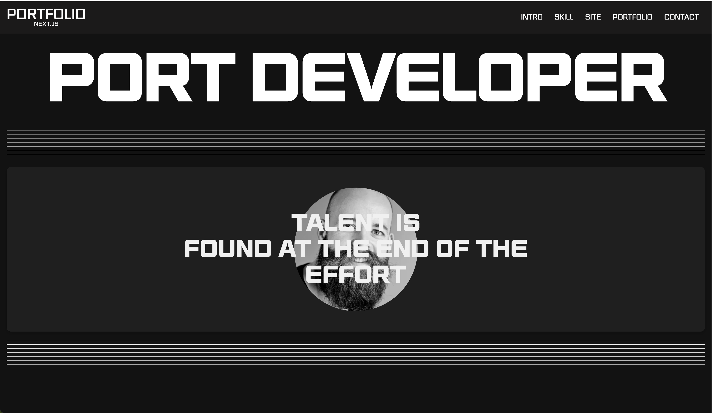

# Next.js를 이용한 포트폴리오

Next.js를 사용하여 포트폴리오 만들기 입니다.



## 구조

프로젝트 디렉토리 구조는 다음과 같습니다.

```
next-site
├── .next
├── node_modules
├── public
│   ├── favicon.svg
├── src
│   ├── app
│   │   ├── about
│   │   │   ├── layout.js
│   │   │   ├── page.js
│   ├── assets
│   │   ├── img
│   │   ├── scss
            ├── common.scss
            ├── fonts.scss
            ├── mixin.scss
            ├── reset.scss
            ├── style.scss
            ├── vars.scss
│   ├── components
│   │   ├── Contact.jsx
│   │   ├── Footer.jsx
│   │   ├── Header.jsx
│   │   ├── Intro.jsx
│   │   ├── Port.jsx
│   │   ├── Site.jsx
│   │   ├── Skill.jsx
│   │   ├── Skip.jsx
│   ├── constants
│   │   ├── index.js
│   ├── utils
│   │   ├── lenis.js
│   │   ├── link.js
├── .eslintrc.json
├── .gitignore
├── jsconfig.json
├── next.config.mjs
├── package-lock.json
├── package.json
├── README.md
```

## 설치 및 실행 방법

### 최신 버전의 Next.js, React, React-DOM 설치

다음 명령어를 사용하여 최신 버전의 Next.js, React, React-DOM을 설치합니다.

```bash
npm install next@latest react@latest react-dom@latest
```

### 추가 의존성 설치

다음 명령어를 사용하여 필요한 패키지를 설치합니다.

```bash
npm install
npm i gsap sass @studio-freight/lenis
```

### 개발 서버 실행

다음 명령어를 사용하여 개발 서버를 실행합니다:

```bash
npm run dev
```

브라우저에서 `http://localhost:3000`을 열어 확인합니다.

## 코드 설명

### `utils/lenis.js`

`lenis.js` 파일은 Lenis 라이브러리를 사용하여 부드러운 스크롤 애니메이션을 구현합니다.

```javascript
import Lenis from "@studio-freight/lenis";

const lenis = () => {
  const lenis = new Lenis({
    duration: 1,
    easing: (t) => Math.min(1, 1.001 - Math.pow(2, -10 * t)),
  });

  function raf(time) {
    lenis.raf(time);
    requestAnimationFrame(raf);
  }

  requestAnimationFrame(raf);

  lenis.on("scroll", (e) => {
    console.log(e);
  });
};

export default lenis;
```

- `Lenis` 객체를 생성하고 스크롤 애니메이션의 `duration`과 `easing` 함수를 설정합니다.
- `requestAnimationFrame`을 사용하여 지속적으로 스크롤 상태를 업데이트합니다.
- 스크롤 이벤트가 발생할 때마다 콘솔에 이벤트 정보를 출력합니다.

### `utils/link.js`

`link.js` 파일은 페이지 내 앵커 링크를 부드럽게 이동하도록 처리합니다.

```javascript
const link = () => {
  document.querySelectorAll('a[href^="#"]').forEach((anchor) => {
    anchor.addEventListener("click", function (e) {
      e.preventDefault();

      const targetId = this.getAttribute("href");
      const targetElement = document.querySelector(targetId);

      if (targetElement) {
        targetElement.scrollIntoView({ behavior: "smooth" });
      }
    });
  });
};

export default link;
```

- 페이지 내의 모든 앵커 링크를 선택하고 클릭 이벤트를 처리합니다.
- 클릭 시 기본 동작을 막고, 해당 앵커로 부드럽게 스크롤 이동합니다.

### `pages/index.js`

`index.js` 파일은 메인 페이지 컴포넌트를 정의하고, 필요한 초기화 작업을 수행합니다.

```javascript
"use client";

import Contact from "@/components/Contact";
import Footer from "@/components/Footer";
import Header from "@/components/Header";
import Intro from "@/components/Intro";
import Port from "@/components/Port";
import Site from "@/components/Site";
import Skill from "@/components/Skill";
import Skip from "@/components/Skip";
import lenis from "@/utils/lenis";
import link from "@/utils/link";
import { useEffect } from "react";

export default function Home() {
  useEffect(() => {
    lenis();
    link();
  }, []);

  return (
    <>
      <Skip />
      <Header />
      <Intro />
      <Skill />
      <Site />
      <Port />
      <Contact />
      <Footer />
    </>
  );
}
```

- `useEffect` 훅을 사용하여 컴포넌트가 마운트될 때 `lenis`와 `link` 함수를 호출합니다.
- 페이지를 구성하는 다양한 컴포넌트를 포함하여 렌더링합니다.

## Vercel 배포

프로젝트를 Vercel에 배포하기 위해 다음 단계를 따릅니다.

1. [Vercel 계정](https://vercel.com/)을 만듭니다.
2. Vercel 대시보드에서 'New Project' 버튼을 클릭합니다.
3. GitHub, GitLab 또는 Bitbucket 계정을 연결합니다.
4. 배포할 레포지토리를 선택합니다.
5. 프로젝트 설정을 확인하고 'Deploy' 버튼을 클릭합니다.

배포가 완료되면, Vercel은 자동으로 프로젝트의 URL을 제공합니다. 이 URL을 사용하여 웹사이트에 접근할 수 있습니다.

## 사용 기술

- **Next.js**: React 기반의 프레임워크로 서버 사이드 렌더링 및 정적 사이트 생성 기능 제공
- **React**: 사용자 인터페이스를 구축하기 위한 라이브러리
- **SCSS**: CSS 전처리기
- **GSAP**: 애니메이션 라이브러리
- **Lenis**: 스크롤 애니메이션 라이브러리
